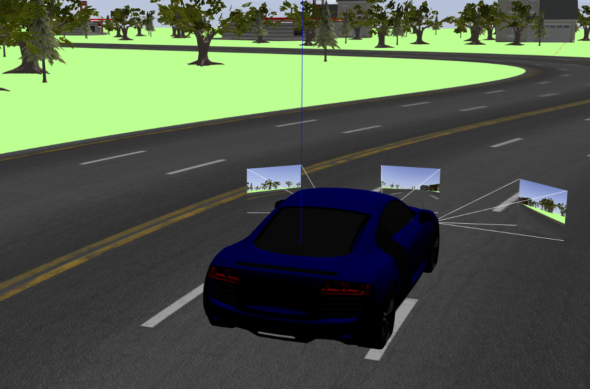

# ILIAR - Projet de Conduite Autonome

## Description
Ce projet s'inscrit dans le cadre de l'enseignement de l'IA et de la robotique à **ILIAR**. L'objectif est de concevoir un système de **conduite autonome** permettant à une voiture simulée de naviguer sur un circuit en prédisant l'angle de braquage à partir d'un flux vidéo. Le but final est d'optimiser la distance parcourue tout en restant dans sa voie.


## Utilisation des fichiers de lancement

Le projet utilise des fichiers de lancement **ROS 2** pour initialiser la simulation et les différents nœuds de contrôle.
### **Fichier de lancement pour la téléopération et l'enregistrement des données**

Ce fichier de lancement permet de démarrer la simulation en mode téléopération et d'activer l'enregistrement des données pour l'entraînement du modèle de conduite autonome.

#### **Composants lancés :**
- **Simulation Gazebo avec téléopération** : Charge un monde spécifique et permet le contrôle manuel du véhicule via un joystick.
- **Enregistrement des données** : Active le nœud `record_dataset` pour capturer les images et commandes de l'utilisateur en vue de l'entraînement du modèle.

#### **Commande pour lancer la téléopération avec enregistrement des données :**
```bash
ros2 launch iliar_solution teleop_record.launch.xml
```
### **Autopilot**
Un second fichier de lancement est disponible pour exécuter uniquement la simulation avec l'autopilot :

- **Simulation Gazebo** : Chargement du monde spécifié.
- **Autopilot** : Exécution du modèle de conduite autonome avec synchronisation sur le temps simulé.
```bash
ros2 launch iliar_solution autopilot.launch.xml
```

Ces fichiers de lancement permettent une configuration rapide et flexible du système en fonction des besoins spécifiques (téléopération, test du modèle autonome, ou visualisation).

### **Autopilot+Teleop**
Le fichier principal permet de configurer et de lancer la simulation en intégrant plusieurs composants essentiels :

- **Simulation Gazebo** : Chargement du monde et de l'interface graphique.
- **RViz** : Visualisation de l'environnement et des données.
- **Téléopération** : Activation du contrôle manuel via un joystick.
- **Autopilote** : Exécution du modèle de conduite autonome.
- **Multiplexeur de commandes** : Gestion des priorités entre le téléopérateur et l'autopilote.
```bash
ros2 launch iliar_solution autopilot_teleop.launch.xml
```